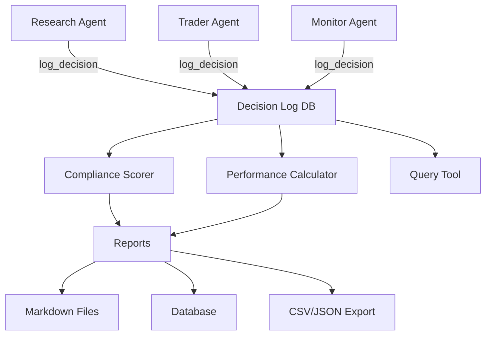

# Detailed Design: Decision Audit & Performance Logging

## Overview

A passive logging and evaluation system that captures every AI decision with structured rule tags and reasoning, enabling trading performance analysis and AI compliance scoring. Integrates into the existing MCP tools server as new tools and database tables.

## Detailed Requirements

1. Log ALL decision points (entry, exit, hold, skip, adjust) with full reasoning
2. Structured rule tags for automated compliance checking + free-text reasoning for human review
3. Fire-and-forget logging (no context bloat during trading sessions)
4. Every log entry tagged with active SOP version for cross-version comparison
5. Two evaluation dimensions: trading performance (profitability) and AI compliance (rule-following)
6. 9 violation types: PANIC_SELL, EARLY_EXIT, IGNORED_ENTRY_SIGNAL, IGNORED_EXIT_SIGNAL, OVERSIZED, UNDERSIZED, RULE_CONFLICT, UNTAGGED_DECISION, SOP_DEVIATION
7. Reports: daily (EOD cron), weekly (weekend cron), on-demand (MCP tool)
8. Reports stored in database AND as markdown files
9. Queryable decision log via MCP tool
10. CSV/JSON export capability
11. No hard gates — logging only (gatekeeper is a future feature)

## Architecture Overview



All agents call `log_decision` at every decision point. The compliance scorer and performance calculator read from the decision log to produce reports.

## Components and Interfaces

### 1. Decision Log (MCP Tool + DB Table)

**Tool:** `log_decision`

```python
log_decision(
    agent: str,           # "research", "trader", "monitor", "orchestrator"
    action: str,          # "enter", "exit", "hold", "skip", "adjust"
    symbol: str,
    rules_triggered: str, # JSON array of rule IDs that caused this action
    rules_considered: str, # JSON array of rule IDs evaluated but not triggered
    reasoning: str,       # 1-2 sentence explanation
    sop_version: str,
    plan_id: str = "",    # links to trade plan if applicable
    market_context: str = "", # JSON: price, rsi, volume, etc. at decision time
) -> str
```

Returns: `{"logged": true, "decision_id": "abc123"}`

**Constraint:** This tool must return immediately. No heavy computation.

### 2. Decision Query (MCP Tool)

**Tool:** `query_decisions`

```python
query_decisions(
    symbol: str = "",
    agent: str = "",
    action: str = "",
    sop_version: str = "",
    start_date: str = "",
    end_date: str = "",
    has_violation: bool | None = None,
    limit: int = 50,
) -> str
```

Returns: JSON array of decision records matching filters.

### 3. Performance Report (MCP Tool)

**Tool:** `generate_performance_report`

```python
generate_performance_report(
    start_date: str,
    end_date: str,
    sop_version: str = "",  # filter by version, or "" for all
    export_format: str = "summary",  # "summary", "json", "csv"
) -> str
```

Returns: Trading performance metrics + AI compliance score.

**Trading metrics calculated:**
- Win rate (% of closed trades that were profitable)
- Profit factor (gross profit / gross loss)
- Expectancy (avg $ per trade)
- Total P&L, total trades
- Avg winner, avg loser
- Max drawdown (peak-to-trough)
- Performance by symbol
- Performance by SOP version (if multiple)

**AI compliance metrics calculated:**
- Compliance rate (% of decisions with no violations)
- Violations by type (count + examples)
- Rule conflict incidents
- Untagged decision count

### 4. Compliance Scorer (Internal Module)

Not an MCP tool — called internally by the report generator.

**Scoring logic:**

| Violation | Detection Method |
|-----------|-----------------|
| `PANIC_SELL` | Exit logged, but market_context.price > plan.stop_loss at exit time |
| `EARLY_EXIT` | Exit logged, but price hasn't hit take_profit AND time_stop not expired AND no valid exit rule tagged |
| `IGNORED_ENTRY_SIGNAL` | Monitor/research logged "skip" but market_context shows SOP entry criteria were met |
| `IGNORED_EXIT_SIGNAL` | Monitor logged "hold" but market_context shows exit criteria were met |
| `OVERSIZED` | Transaction quantity > calc_position_size result for the plan's risk params |
| `UNDERSIZED` | Transaction quantity < 50% of calc_position_size result |
| `RULE_CONFLICT` | rules_triggered contains two rules that are tagged as conflicting in the SOP |
| `UNTAGGED_DECISION` | action is "enter" or "exit" but rules_triggered is empty |
| `SOP_DEVIATION` | action taken doesn't match any rule in the active SOP version |

**Note:** Some violations (PANIC_SELL, EARLY_EXIT, IGNORED_EXIT_SIGNAL) require cross-referencing the decision log with trade plans and market data. Others (UNTAGGED_DECISION, RULE_CONFLICT) can be detected from the log entry alone.

### 5. Export (MCP Tool)

**Tool:** `export_decisions`

```python
export_decisions(
    start_date: str,
    end_date: str,
    format: str = "json",  # "json" or "csv"
    symbol: str = "",
    sop_version: str = "",
) -> str
```

Returns: file path where the export was saved.

## Data Models

### DecisionLogEntry

```python
@dataclass
class DecisionLogEntry:
    decision_id: str          # auto-generated UUID
    timestamp: datetime       # when the decision was made
    agent: str                # research, trader, monitor, orchestrator
    action: str               # enter, exit, hold, skip, adjust
    symbol: str
    rules_triggered: list[str]  # rule IDs that caused this action
    rules_considered: list[str] # rule IDs evaluated but not triggered
    reasoning: str            # 1-2 sentence explanation
    sop_version: str          # e.g., "v1.0.0"
    plan_id: str              # links to trade plan
    market_context: dict      # price, rsi, volume, etc.
    violations: list[str]     # populated by compliance scorer (initially empty)
```

### PerformanceReport

```python
@dataclass
class PerformanceReport:
    report_id: str
    report_type: str          # "daily", "weekly", "on_demand"
    start_date: datetime
    end_date: datetime
    sop_version: str
    # Trading metrics
    total_trades: int
    win_rate: float
    profit_factor: float
    expectancy: float
    total_pnl: float
    avg_winner: float
    avg_loser: float
    max_drawdown: float
    # Compliance metrics
    total_decisions: int
    compliance_rate: float
    violations: dict[str, int]  # type -> count
    # Metadata
    generated_at: datetime
```

## Database Schema

### decisions table

```sql
CREATE TABLE IF NOT EXISTS decisions (
    decision_id TEXT PRIMARY KEY,
    timestamp TEXT NOT NULL,
    agent TEXT NOT NULL,
    action TEXT NOT NULL,
    symbol TEXT NOT NULL,
    rules_triggered TEXT,      -- JSON array
    rules_considered TEXT,     -- JSON array
    reasoning TEXT,
    sop_version TEXT,
    plan_id TEXT,
    market_context TEXT,       -- JSON object
    violations TEXT            -- JSON array, populated by scorer
);
```

### performance_reports table

```sql
CREATE TABLE IF NOT EXISTS performance_reports (
    report_id TEXT PRIMARY KEY,
    report_type TEXT NOT NULL,
    start_date TEXT NOT NULL,
    end_date TEXT NOT NULL,
    sop_version TEXT,
    metrics TEXT NOT NULL,     -- JSON blob with all metrics
    generated_at TEXT NOT NULL
);
```

### transaction_ledger table

Every broker action (buy, sell, cancel) is logged here **automatically** by `place_order` and `cancel_order` — no agent action required. This is the single source of truth for "what actually happened." The old `save_transaction` tool is deprecated (replaced by auto-logging).

```sql
CREATE TABLE IF NOT EXISTS transaction_ledger (
    ledger_id TEXT PRIMARY KEY,
    timestamp TEXT NOT NULL,
    -- What happened
    action TEXT NOT NULL,            -- "buy", "sell", "cancel"
    symbol TEXT NOT NULL,
    quantity INTEGER,
    order_type TEXT,                 -- "market", "limit", "stop", "stop_limit"
    price REAL,                      -- fill price (0 if pending/cancelled)
    total_cost REAL,                 -- price * quantity (+ fees)
    fees REAL DEFAULT 0,
    status TEXT NOT NULL,            -- "filled", "partial", "pending", "cancelled", "rejected"
    broker_order_id TEXT,
    -- Account state at time of transaction
    account_equity REAL,
    account_cash REAL,
    buying_power REAL,
    -- P&L (populated on sells)
    pnl REAL,                        -- realized P&L for this sell (null for buys)
    pnl_pct REAL,                    -- realized P&L % (null for buys)
    entry_price REAL,                -- original entry price (populated on sells)
    -- Context
    plan_id TEXT,                    -- links to trade plan if applicable
    decision_id TEXT,                -- links to the decision that triggered this
    sop_version TEXT,
    platform TEXT NOT NULL,          -- "alpaca_paper", "alpaca_live", "simulation"
    trigger TEXT,                    -- "agent", "kill_switch", "trailing_stop", "manual"
    notes TEXT                       -- rejection reason, cancel reason, etc.
);
```

**Write points (no duplication — each action writes exactly once):**
1. `place_order` tool → writes one ledger entry (buy or sell)
2. `cancel_order` tool → writes one ledger entry (cancel)
3. Kill switch → writes ledger entries for each position closed (trigger="kill_switch")

**The old `save_transaction` MCP tool is deprecated.** Agents no longer need to manually log transactions — it happens automatically. The existing `trade_transactions` table remains for backward compatibility but is no longer the source of truth.

This enables:
- Full audit trail of every broker interaction
- P&L tracking per sell (entry_price vs exit price)
- Account state snapshot at every transaction (equity trending)
- Matching decisions to actual executions (decision_id → ledger entry)
- Detecting orphan transactions (executions without a logged decision = `UNTAGGED_DECISION`)
- Filtering by platform, trigger source, SOP version

## Error Handling

- `log_decision` never throws — wraps all errors and returns `{"logged": false, "error": "..."}`. Trading must never be blocked by a logging failure.
- `query_decisions` returns empty array on error.
- `generate_performance_report` returns error JSON if insufficient data.
- Compliance scorer skips violations it can't verify (e.g., missing market_context).

## Testing Strategy

- Unit tests for compliance scorer (given a decision + trade plan + market data, detect correct violations)
- Unit tests for performance calculator (given a set of closed trades, compute correct metrics)
- Unit tests for query filtering
- Integration test: log decisions → run report → verify metrics match expected values
- Test that `log_decision` returns in <10ms (fire-and-forget performance)

## Appendices

### Integration with Existing System

- New tables added to existing SQLite database (same `persistence/db.py` schema)
- New tools added to existing `server.py`
- Compliance scorer reads from `trade_plans` and `trade_transactions` tables (already exist)
- **Transaction ledger auto-populated:** `place_order` and `cancel_order` automatically write to `transaction_ledger` — no agent action required. This is the ground truth of what actually happened at the broker.
- Reports written to `reports/` directory as markdown files
- Daily report triggered by existing `eod-review.json` cron
- Weekly report triggered by new `weekly-review.json` cron

### MCP Tools Summary (6 new tools, 1 deprecated)

| Tool | Purpose |
|------|---------|
| `log_decision` | Record a decision with reasoning and rule tags |
| `query_decisions` | Search/filter the decision log |
| `query_transaction_ledger` | Search/filter all broker transactions (buy/sell/cancel) with P&L |
| `generate_performance_report` | Produce trading + compliance metrics |
| `export_decisions` | Export decision log + transaction ledger as CSV or JSON |
| `get_compliance_score` | Quick compliance % for a date range |
| ~~`save_transaction`~~ | **DEPRECATED** — replaced by auto-logging in place_order/cancel_order |

### Future Extensions (not in this implementation)

- Hard gate / sell guard (separate feature)
- Real-time violation alerts via Slack
- A/B testing framework for SOP versions
- Decision replay (re-run with same inputs to test reproducibility)
