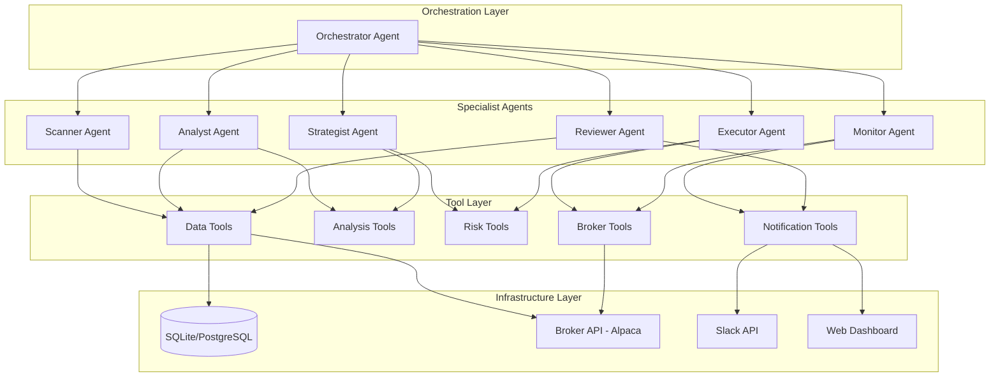
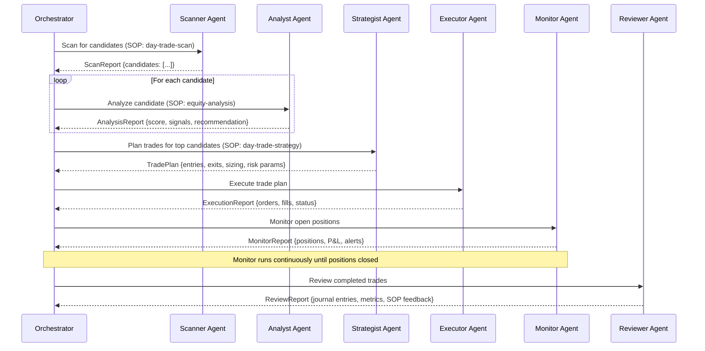
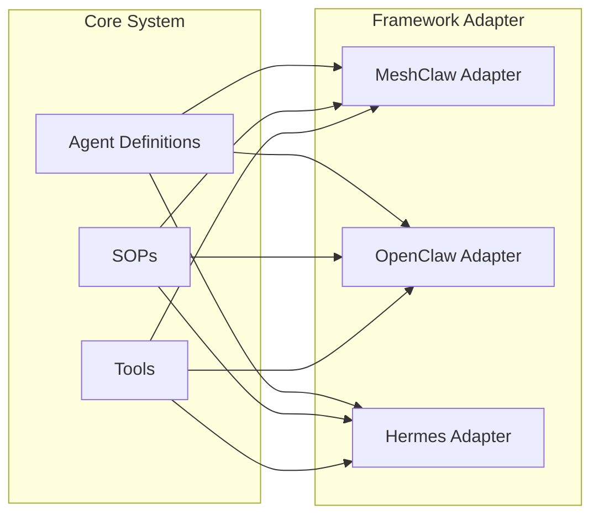
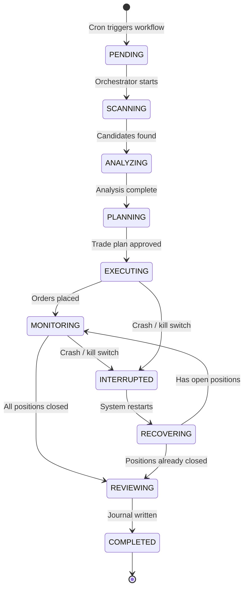
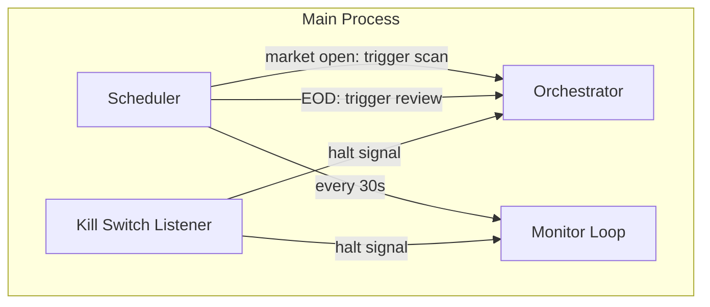
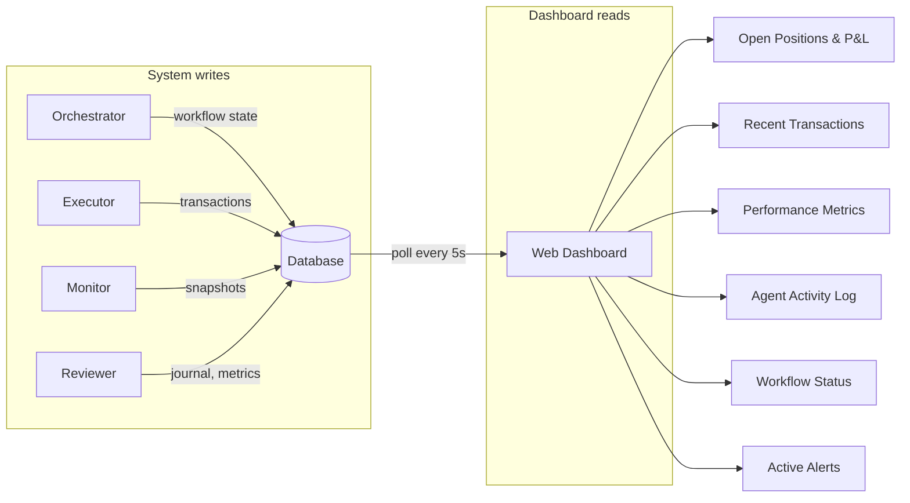
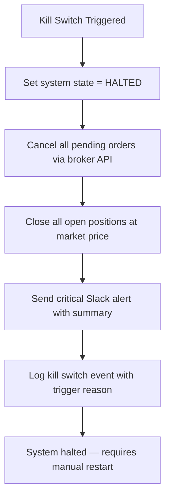
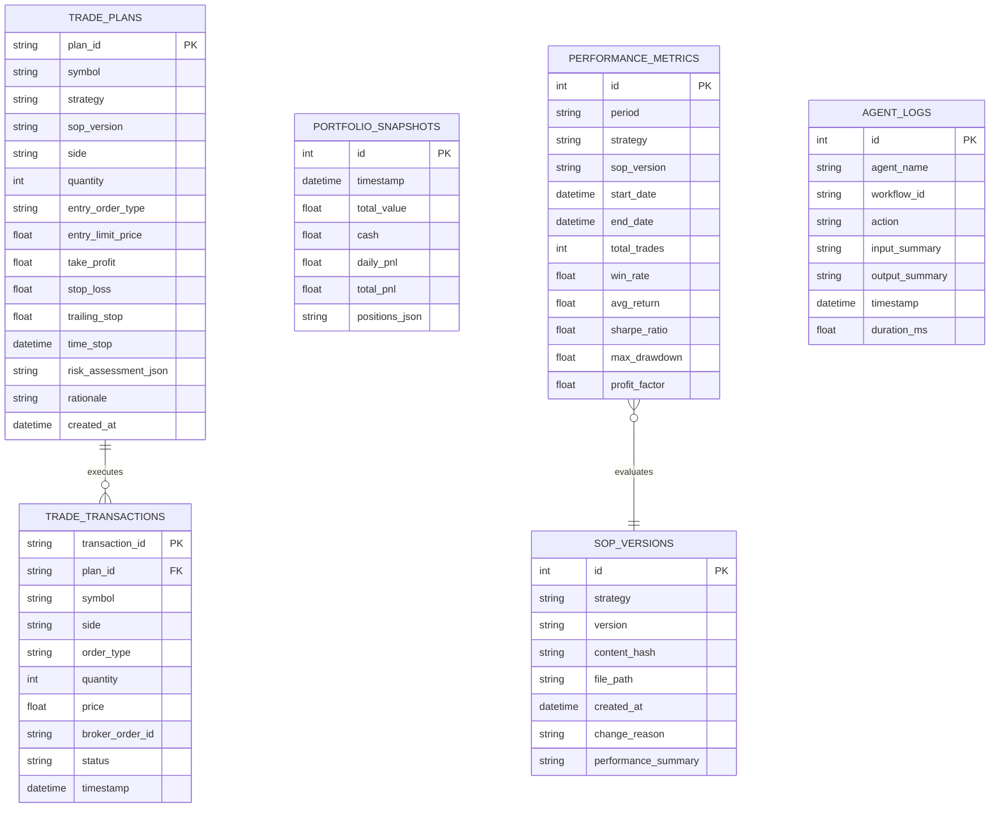
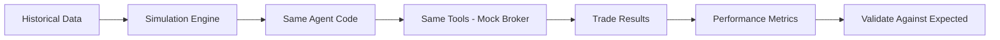
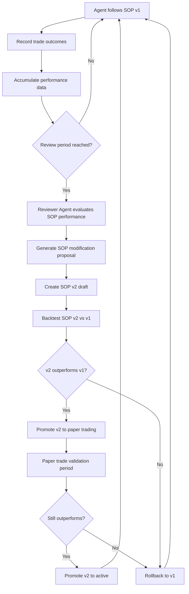

# Detailed Design: Multi-Agent Trading System

## 1. Overview

This document describes the design of a multi-agent autonomous trading system that uses specialized AI agents coordinated through a hub-and-spoke architecture to execute the full trading lifecycle — from market scanning and analysis through execution, monitoring, and post-trade review.

The system is SOP-driven: each agent follows versioned markdown Standard Operating Procedures that define its behavior. Agents are tool-grounded, meaning they use dedicated tools for data retrieval, calculations, and execution rather than relying on LLM reasoning for factual or computational tasks. Over time, the system self-improves by evaluating SOP performance against trading outcomes and promoting better-performing SOP versions.

The MVP targets a single day-trading strategy on Alpaca paper trading, with architecture designed to extend to options, crypto, and prediction markets.

### Key Design Principles

- **Hub-and-spoke coordination**: Central orchestrator delegates to specialist agents
- **SOP-driven behavior**: Agents follow versioned markdown SOPs, not hardcoded logic
- **Tool-grounding**: Agents use tools for facts and calculations; LLM reasoning for synthesis and decisions
- **Framework-agnostic**: Core logic decoupled from agent framework (MeshClaw → OpenClaw/Hermes)
- **Incremental extensibility**: New markets, strategies, and data sources added via new SOPs and tools
- **Live parity**: Backtesting uses the same agent code paths as live trading

## 2. Detailed Requirements

### 2.1 Markets and Assets
- **MVP**: US equities (day trading) via Alpaca paper trading
- **Future**: US options, crypto, prediction markets (Kalshi/Polymarket)
- Forex and futures are excluded

### 2.2 Broker Integration
- **MVP**: Alpaca (paper trading, then live)
- **Future**: Coinbase, Binance, Polymarket, Robinhood, and any broker with an API
- Broker abstraction layer required so additional brokers plug in without changing agent logic

### 2.3 Trading Workflow
The workflow varies by trade type. For day trading (MVP):

1. **Data & Information Gathering** — collect market data, news, sentiment
2. **Market Scanning** — screen for opportunities
3. **Equity Analysis & Evaluation** — deep-dive on candidates
4. **Trading Strategy Planning** — determine strategy, position sizing, entry/exit criteria
5. **Execution** — place trades via broker API
6. **Monitoring** — track open positions in real-time
7. **Exit** — close positions based on criteria
8. **Summary & Review** — post-trade journaling and performance review

### 2.4 Agent Coordination
- Hub-and-spoke model with a central orchestrator
- Orchestrator follows SOPs for each trade type/workflow
- Agents produce structured reports (not free-form chat) to prevent information loss
- Tool-grounded: agents use dedicated tools for data extraction, analysis, calculations, and execution

### 2.5 Autonomy and Human Supervision
- Fully autonomous including placing real trades
- Dashboards and alerts for human monitoring
- Human can intervene/override at any time
- Kill switch for emergency halt

### 2.6 Risk Management
- Position sizing limits (per trade, per asset, total portfolio)
- Daily loss limits and drawdown limits
- Concentration limits
- Trailing stops and price-based exit principles
- Custom risk rules per workflow/trade type
- Backtesting system for strategy validation
- Paper trading mode via Alpaca
- Kill switch for emergency halt

### 2.7 Technology Stack
- **Language**: Python
- **Runtime**: Local machine initially
- **Agent framework**: MeshClaw for development; OpenClaw/Hermes for production
- **Data storage**: SQLite initially, PostgreSQL later
- **Scheduling**: Cron jobs initially; streaming price data aspirational
- Framework-agnostic design to support migration

### 2.8 Data Sources
- **Live trading**: Real-time data from broker API (Alpaca)
- **Development/backtesting**: Historical data cached in local SQLite database
- **MVP scanning**: News, sentiment, and fundamentals needed for candidate identification
- **MVP entry/exit**: Price action and technical indicators
- **Future**: Web scraping, social media sentiment, alternative data via extensible tool system

### 2.9 Notifications and Dashboard
- **Notifications**: Slack (primary), extensible to other messaging
- **Dashboard**: Web UI
- **Content**: Every transaction, P&L updates, agent decisions, summaries, errors
- **Frequency**: Periodic summaries + event-triggered alerts

### 2.10 Trade Journaling and Review
- Automatic logging of every trade with entry/exit rationale, strategy, outcome
- Performance metrics: win rate, average return, Sharpe ratio, max drawdown, per-strategy breakdown
- Review cadence: per-trade, daily summary, weekly report
- Self-improving: system uses past performance to adjust strategies/SOPs over time

### 2.11 Strategy Approach
- Market-specific agents (stocks, options, crypto, prediction markets) running independently
- SOP-driven initially; self-improving long-term
- Multiple strategies can run simultaneously across different market agents
- MVP: one day-trading strategy for US equities

### 2.12 SOP Structure
- Format: Markdown
- Granularity: One SOP per strategy
- Versioned with performance metrics per version
- Tunable parameters (constants or dynamically determined by agent reasoning)

### 2.13 Error Handling
- **API failures**: Retry up to 10 times; if still failing, stop trading for the day (live only)
- **Partial fills**: Buy orders — accept partial or cancel remainder. Stop-loss orders — retry until completely filled
- **Market hours**: Only trade during market hours
- **Agent failures**: Retry agent, send alert to human
- **Conflicting signals**: Orchestrator analyzes conflict, decides, logs reasoning, alerts human if needed

### 2.14 MVP Success Criteria
1. Single orchestrator agent running one day-trading strategy on Alpaca paper trading
2. SOP-driven — follows a defined markdown SOP
3. Trade journaling — every trade logged with rationale and outcome
4. Slack notifications — alerts on trades, summaries, significant events
5. Profitable on paper trading
6. Reliable backtesting — identical behavior to live trading (no look-ahead bias)
7. Extensible architecture for new SOPs, strategies, and markets

## 3. Architecture Overview

The system follows a layered architecture with clear separation between orchestration, agent logic, tools, and infrastructure.



### 3.1 Layer Responsibilities

| Layer | Responsibility |
|-------|---------------|
| **Orchestration** | Workflow management, SOP execution, agent delegation, decision synthesis |
| **Specialist Agents** | Domain-specific tasks guided by SOPs, produce structured reports |
| **Tool Layer** | Deterministic operations: data fetching, calculations, API calls, persistence |
| **Infrastructure** | External systems: database, broker APIs, notification channels |

### 3.2 Hub-and-Spoke Communication Flow



### 3.3 Framework Abstraction

The system is designed to run on multiple agent frameworks. A thin adapter layer translates between the core system and the framework runtime.



The adapter is responsible for:
- Registering agents with the framework
- Loading SOPs into the framework's skill/prompt system
- Exposing tools via the framework's tool protocol (e.g., MCP)
- Translating inter-agent communication to the framework's messaging model

### 3.4 Workflow State Management

The orchestrator manages multi-step workflows where a crash mid-workflow could leave open positions unmanaged. A checkpoint mechanism persists workflow state so any interrupted run can be recovered.

**Workflow Run Lifecycle:**



**Checkpoint Mechanism:**
After each state transition, the orchestrator writes a checkpoint to the database before proceeding. On startup, it checks for incomplete workflow runs and resumes from the last checkpoint.

```python
@dataclass
class WorkflowCheckpoint:
    workflow_run_id: str
    status: str                    # PENDING, SCANNING, ANALYZING, etc.
    started_at: datetime
    updated_at: datetime
    sop_name: str
    sop_version: str
    scan_report: str | None        # serialized ScanReport
    analysis_reports: str | None   # serialized list[AnalysisReport]
    trade_plan: str | None         # serialized TradePlan
    execution_report: str | None   # serialized ExecutionReport
    open_positions: str | None     # serialized position list
    error: str | None
```

**Recovery Rules:**
| Interrupted State | Recovery Action |
|---|---|
| SCANNING / ANALYZING / PLANNING | Discard and restart — no positions at risk |
| EXECUTING | Query broker for order status, reconcile with trade plan, resume monitoring for any filled orders |
| MONITORING | Reload open positions from broker, resume monitoring with original exit criteria |

**Database Table:**

```sql
CREATE TABLE workflow_runs (
    workflow_run_id TEXT PRIMARY KEY,
    status TEXT NOT NULL,
    started_at DATETIME NOT NULL,
    updated_at DATETIME NOT NULL,
    sop_name TEXT NOT NULL,
    sop_version TEXT NOT NULL,
    checkpoint_data TEXT,  -- JSON blob of serialized state
    error TEXT
);
```

### 3.5 Concurrency and Scheduling Model

The system runs as a single long-running process with internal scheduling. This avoids race conditions from concurrent cron invocations and gives the Monitor agent a persistent runtime.

**Process Architecture:**



**Scheduling Rules:**
- **Startup**: On launch, check for interrupted workflow runs and recover (§3.4). Then start the scheduler.
- **Market scan**: Triggered once at configurable time after market open (e.g., 9:45 AM ET). Orchestrator runs the full scan → analyze → plan → execute workflow.
- **Monitor loop**: Runs on a fixed interval (default 30s) whenever open positions exist. Not an LLM call every tick — the Monitor agent uses tools to check positions and only invokes LLM reasoning when an exit condition is approaching or triggered.
- **End-of-day review**: Triggered at configurable time (e.g., 4:15 PM ET). Closes any remaining positions, then runs the Reviewer agent.
- **No concurrent workflows**: Only one scan→execute workflow runs at a time. If the previous workflow is still in MONITORING, a new scan is skipped. This prevents conflicting position sizing.

**Monitor Agent Design:**
The Monitor is the only long-running agent. To avoid burning LLM tokens on every tick:
1. **Tool-only checks** (every 30s): A tool fetches positions and current prices, computes P&L, and checks exit conditions against the TradePlan thresholds. No LLM involved.
2. **LLM escalation** (only when needed): If an exit condition is within a configurable threshold (e.g., price within 1% of stop-loss), or an alert condition triggers, the Monitor agent is invoked with LLM reasoning to decide the action.
3. **Periodic summary** (configurable, e.g., every 15 min): LLM generates a brief position summary for the dashboard/Slack.

### 3.6 Dashboard

The dashboard is a read-only web UI that displays system state. It does not control the system — control happens via Slack commands and the kill switch.

**Tech choice:** Lightweight Python web framework (FastAPI + HTMX or Streamlit). The dashboard queries the SQLite/PostgreSQL database directly — no separate API layer needed for MVP.

**Data flow:**



**Pages:**

| Page | Data Source | Content |
|------|-----------|---------|
| **Portfolio** | `TRADE_PLANS`, `TRADE_TRANSACTIONS`, `PORTFOLIO_SNAPSHOTS` | Open positions, unrealized P&L, daily P&L, portfolio value chart |
| **Transactions** | `TRADE_TRANSACTIONS`, `TRADE_PLANS` | Transaction history with plan linkage, fill prices vs planned prices |
| **Performance** | `PERFORMANCE_METRICS`, `SOP_VERSIONS` | Win rate, Sharpe, drawdown charts, per-strategy breakdown, SOP version comparison |
| **Activity** | `AGENT_LOGS`, `WORKFLOW_RUNS` | Current workflow state, agent actions, errors |
| **System** | `WORKFLOW_RUNS`, config | Kill switch status, scheduler state, SOP versions in use |

### 3.7 Kill Switch

The kill switch is an emergency halt mechanism that stops all trading and closes positions.

**Trigger mechanisms** (any one activates the kill switch):
1. **Slack command**: Human sends `/kill` to the bot
2. **Automated**: Daily loss limit breached (configurable, e.g., -3% portfolio value)
3. **Automated**: Circuit breaker triggered (broker API down, §6.3)
4. **File-based**: Presence of a `KILL_SWITCH` file in the system directory (for manual/scripted activation)

**Execution sequence:**



**Implementation:**
```python
@dataclass
class KillSwitchState:
    active: bool = False
    triggered_at: datetime | None = None
    trigger_reason: str | None = None  # "manual", "daily_loss_limit", "circuit_breaker"
    orders_cancelled: int = 0
    positions_closed: int = 0
```

The kill switch state is checked at the start of every orchestrator action and every monitor loop tick. If active, all operations are blocked until the human restarts the system and clears the kill switch.

## 4. Components and Interfaces

### 4.1 Orchestrator Agent

The central coordinator that drives the entire trading workflow.

**Responsibilities:**
- Load and execute the appropriate SOP for the current workflow (e.g., day-trade)
- Delegate tasks to specialist agents
- Collect and synthesize agent reports
- Make go/no-go decisions at each workflow gate
- Handle errors and escalate to human when needed
- Trigger the review cycle after trades close

**Inputs:** SOP definition, market schedule, portfolio state
**Outputs:** Delegation commands, final trade decisions, workflow logs

**SOP Execution Model:**
The orchestrator traverses the SOP as a decision graph (per SOP-Agent research). At each node, it:
1. Identifies the next action and target agent
2. Provides the agent with filtered context (only relevant data)
3. Collects the agent's structured report
4. Evaluates conditions to determine the next node

### 4.2 Scanner Agent

Identifies trading candidates from the broader market.

**Responsibilities:**
- Gather market data, news, and sentiment using data tools
- Apply screening criteria defined in the SOP
- Rank candidates by opportunity score
- Produce a structured ScanReport

**Tools available:** market data API, news API, sentiment tools, screener tools
**Input:** SOP scanning criteria, market state
**Output:** `ScanReport`

```python
@dataclass
class ScanCandidate:
    symbol: str
    score: float          # composite opportunity score
    signals: list[str]    # reasons this candidate was selected
    data: dict            # raw data snapshot (price, volume, news hits)

@dataclass
class ScanReport:
    timestamp: datetime
    candidates: list[ScanCandidate]
    market_context: str   # brief market conditions summary
    sop_version: str      # which SOP version produced this scan
```

### 4.3 Analyst Agent

Performs deep-dive analysis on individual candidates.

**Responsibilities:**
- Run technical analysis (RSI, MACD, SMA, volume profile) via analysis tools
- Gather fundamental data if required by SOP
- Assess news/sentiment context
- Score the candidate and produce a recommendation

**Tools available:** technical indicator calculator, fundamental data API, sentiment tools
**Input:** candidate symbol, SOP analysis criteria
**Output:** `AnalysisReport`

```python
@dataclass
class AnalysisReport:
    symbol: str
    timestamp: datetime
    technical_score: float
    fundamental_score: float | None
    sentiment_score: float | None
    overall_score: float
    recommendation: str        # "strong_buy", "buy", "neutral", "avoid"
    signals: list[str]         # specific signals identified
    key_levels: dict           # support, resistance, entry zones
    sop_version: str
```

### 4.4 Strategist Agent

Plans the trade based on analysis results and risk constraints.

**Responsibilities:**
- Determine entry price, exit targets, and stop-loss levels
- Calculate position size using risk tools
- Validate the plan against portfolio-level risk limits
- Produce a complete trade plan

**Tools available:** position sizer, risk calculator, portfolio state reader
**Input:** AnalysisReport(s), portfolio state, risk parameters from SOP
**Output:** `TradePlan`

```python
@dataclass
class TradePlan:
    plan_id: str
    symbol: str
    timestamp: datetime
    side: str                  # "buy" or "sell_short" — the intended direction
    quantity: int
    entry_order_type: str      # "market", "limit", "stop_limit"
    entry_limit_price: float | None
    take_profit: float
    stop_loss: float
    trailing_stop: float | None
    time_stop: datetime | None # max hold duration
    risk_assessment: dict      # position risk %, portfolio impact
    rationale: str             # why this trade, in plain text
    sop_version: str
```

### 4.5 Executor Agent

Places and manages orders through the broker.

**Responsibilities:**
- Translate TradePlan into broker API calls
- Place orders and confirm fills
- Handle partial fills per error handling rules
- Set up stop-loss and take-profit orders
- Report execution results

**Tools available:** broker order API, broker account API
**Input:** `TradePlan`
**Output:** `TradeTransaction` records, `ExecutionReport`

Each order fill produces a `TradeTransaction` that references the plan:

```python
@dataclass
class TradeTransaction:
    transaction_id: str
    plan_id: str               # links back to the TradePlan that produced this
    symbol: str
    side: str                  # "buy" or "sell" — buy=entry, sell=exit (or vice versa for shorts)
    order_type: str            # "market", "limit", "stop", "trailing_stop"
    quantity: int
    price: float               # actual fill price
    broker_order_id: str
    status: str                # "filled", "partial", "rejected", "cancelled"
    timestamp: datetime

@dataclass
class ExecutionReport:
    timestamp: datetime
    transactions: list[TradeTransaction]
    errors: list[str]
```

### 4.6 Monitor Agent

Tracks open positions and triggers alerts or exits.

**Responsibilities:**
- Poll or stream position and price data
- Evaluate exit conditions (take-profit, stop-loss, trailing stop, time stop)
- Trigger exit orders when conditions are met
- Send alerts on significant events (P&L thresholds, risk breaches)
- Report position status periodically

**Tools available:** broker positions API, broker streaming API, notification tools
**Input:** open positions, exit criteria from TradePlan
**Output:** `MonitorReport`, exit triggers

```python
@dataclass
class PositionStatus:
    symbol: str
    quantity: int
    entry_price: float
    current_price: float
    unrealized_pnl: float
    unrealized_pnl_pct: float
    exit_triggered: bool
    exit_reason: str | None

@dataclass
class MonitorReport:
    timestamp: datetime
    positions: list[PositionStatus]
    portfolio_value: float
    daily_pnl: float
    alerts: list[str]
```

### 4.7 Reviewer Agent

Performs post-trade analysis and drives the self-improvement loop.

**Responsibilities:**
- Create trade journal entries with full context
- Calculate performance metrics
- Generate daily summaries and weekly reports
- Evaluate SOP performance and suggest improvements
- Send review notifications

**Tools available:** database read/write, metrics calculator, notification tools
**Input:** completed trade data, historical performance
**Output:** `ReviewReport`

```python
@dataclass
class JournalEntry:
    plan_id: str               # links to the TradePlan
    symbol: str
    strategy: str
    sop_version: str
    entry_transactions: list[str]   # transaction IDs for entries
    exit_transactions: list[str]    # transaction IDs for exits
    pnl: float
    pnl_pct: float
    rationale: str             # from TradePlan
    exit_reason: str
    lessons: str               # agent's reflection on the trade

@dataclass
class ReviewReport:
    timestamp: datetime
    journal_entries: list[JournalEntry]
    metrics: dict             # win_rate, avg_return, sharpe, max_drawdown
    sop_feedback: str         # suggested SOP improvements
    period: str               # "trade", "daily", "weekly"
```

### 4.8 Tool Layer

Tools are deterministic functions that agents invoke for factual/computational tasks. Each tool has a typed interface and is registered with the agent framework via MCP or equivalent protocol.

**Tool Categories:**

| Category | Tools | Used By |
|----------|-------|---------|
| **Data** | `get_market_data`, `get_historical_data`, `get_news`, `get_sentiment`, `search_web` | Scanner, Analyst |
| **Analysis** | `calc_technical_indicators`, `calc_fundamentals_score`, `calc_probability` | Analyst, Strategist |
| **Risk** | `calc_position_size`, `check_portfolio_risk`, `check_daily_limits`, `get_portfolio_state` | Strategist, Executor, Monitor |
| **Broker** | `place_order`, `cancel_order`, `get_positions`, `get_account`, `stream_prices` | Executor, Monitor |
| **Notification** | `send_slack_message`, `update_dashboard` | Monitor, Reviewer, Orchestrator |
| **Persistence** | `write_journal`, `read_journal`, `write_metrics`, `read_metrics`, `read_sop`, `write_sop` | Reviewer, Orchestrator |

**Filtered Tool Sets:** Following the SOP-Agent research, each agent only has access to tools relevant to its role. This prevents agents from skipping steps or using inappropriate tools.

### 4.9 Broker Abstraction Layer

```python
from abc import ABC, abstractmethod

class BrokerAdapter(ABC):
    """Abstract broker interface. Implement per broker."""

    @abstractmethod
    def place_order(self, symbol: str, side: str, order_type: str, quantity: int,
                    limit_price: float | None = None, stop_price: float | None = None) -> TradeTransaction: ...

    @abstractmethod
    def cancel_order(self, order_id: str) -> bool: ...

    @abstractmethod
    def get_positions(self) -> list[dict]: ...

    @abstractmethod
    def get_account(self) -> dict: ...

    @abstractmethod
    def get_market_data(self, symbol: str) -> dict: ...

    @abstractmethod
    def get_historical_data(self, symbol: str, start: datetime, end: datetime, timeframe: str) -> list[dict]: ...

    @abstractmethod
    def stream_prices(self, symbols: list[str], callback) -> None: ...
```

**MVP implementation:** `AlpacaBrokerAdapter` wrapping the Alpaca Python SDK. Paper and live trading use the same adapter with different base URLs.

## 5. Data Models

### 5.1 Database Schema



### 5.2 Historical Data Cache

```sql
CREATE TABLE price_data (
    symbol TEXT,
    timestamp DATETIME,
    open REAL,
    high REAL,
    low REAL,
    close REAL,
    volume INTEGER,
    timeframe TEXT,  -- "1min", "5min", "1day"
    PRIMARY KEY (symbol, timestamp, timeframe)
);
```

A data loader tool populates this table from Alpaca/Yahoo Finance. Agents query it during backtesting instead of hitting live APIs.

## 6. Error Handling

### 6.1 Error Classification

| Error Type | Severity | Response |
|-----------|----------|----------|
| Broker API timeout | Medium | Retry up to 10 times with exponential backoff |
| Broker API down | High | Stop trading for the day (live only), alert human |
| Partial fill (buy) | Low | Accept partial or cancel remainder |
| Partial fill (stop-loss) | Critical | Retry until completely filled |
| Agent crash/timeout | Medium | Retry agent, alert human |
| Conflicting signals | Medium | Orchestrator decides, logs reasoning, alerts human |
| Market closed | Low | Queue for next open, no action |
| Database write failure | Medium | Retry, fall back to file-based logging, alert |
| Kill switch activated | Critical | Cancel all open orders, close all positions, halt system |

### 6.2 Retry Strategy

```python
@dataclass
class RetryConfig:
    max_retries: int = 10
    base_delay_seconds: float = 1.0
    max_delay_seconds: float = 60.0
    backoff_multiplier: float = 2.0
```

All broker API calls go through a retry wrapper. Stop-loss orders use unlimited retries with alerts after each failure.

### 6.3 Circuit Breaker

If the broker API fails 10 consecutive times:
1. Cancel all pending orders
2. Send critical alert to human via Slack
3. Enter "safe mode" — no new trades, only monitor existing positions
4. Require human intervention to resume trading

## 7. Testing Strategy

### 7.1 Unit Tests
- All tools tested independently with mocked external APIs
- Data models validated with property-based tests
- Risk calculations tested against known scenarios
- Position sizing verified against manual calculations

### 7.2 Integration Tests
- Broker adapter tested against Alpaca paper trading sandbox
- End-to-end workflow tested with mock agents returning canned reports
- Database operations tested with in-memory SQLite
- Notification delivery tested with Slack test channel

### 7.3 Backtesting as Testing

The backtesting system doubles as a comprehensive test harness:



**Key properties:**
- **No look-ahead bias**: Data replayed chronologically; agents only see data available at decision time
- **Same code path**: Agents, SOPs, and tools are identical to live — only the broker adapter is swapped for a simulation adapter
- **Realistic execution**: Simulates slippage, fees, and partial fills

**LLM Non-Determinism Mitigation:**
LLM outputs are inherently non-deterministic (sampling, temperature), so identical inputs won't produce byte-identical backtest runs. Mitigations:
1. **Temperature 0** for all backtest agent calls — minimizes (but doesn't eliminate) output variance
2. **Decision recording**: Every agent decision is logged with its full input context and output. This enables replay analysis even if exact reproduction isn't possible.
3. **Statistical backtesting**: Run each backtest N times (e.g., 10) and report metric distributions (mean, std dev, min, max) rather than single-run results. A strategy must be profitable across the majority of runs to be considered valid.
4. **Tool-grounded decisions reduce variance**: Since agents use tools for data retrieval and calculations, the non-deterministic surface is limited to the LLM's synthesis/decision step — not the underlying data.

**Simulation Broker Adapter:**
Implements the same `BrokerAdapter` interface but executes against historical data:
- Market orders fill at next bar's open price + configurable slippage
- Limit orders fill when price crosses the limit level
- Stop orders trigger when price crosses the stop level
- Fees deducted per trade (configurable, default: Alpaca's fee schedule)

### 7.4 SOP Testing
- Each SOP version backtested before promotion to live
- A/B testing: new SOP vs current SOP on paper trading
- Regression tests: ensure SOP changes don't break workflow execution

### 7.5 Paper Trading Validation
- MVP runs on Alpaca paper trading before any live deployment
- Minimum paper trading period before live: configurable (default 2 weeks)
- Paper trading results compared against backtest predictions to validate backtest fidelity

## 8. SOP Self-Improvement System

### 8.1 Improvement Loop



### 8.2 SOP Versioning

Each SOP file is stored with metadata:
```
sops/
  day-trade-momentum/
    v1.0.0.md          # initial version
    v1.1.0.md          # parameter tuning
    v2.0.0.md          # strategy change
    changelog.md       # what changed and why
    performance.json   # metrics per version
```

Version promotion rules:
- **Patch** (v1.0.x): Parameter tuning only
- **Minor** (v1.x.0): New conditions or rules added
- **Major** (vx.0.0): Fundamental strategy change

### 8.3 Performance-Based Optimization

Following the ATLAS research, the system uses trading performance feedback (not just reflection) to optimize SOPs:
- Track metrics per SOP version: win rate, Sharpe ratio, max drawdown, profit factor
- Compare against baseline (previous version)
- Only promote if statistically significant improvement over minimum sample size

## 9. Appendices

### Appendix A: Technology Choices

| Decision | Choice | Rationale |
|----------|--------|-----------|
| Language | Python | Agent framework compatibility (Hermes, CrewAI, LangGraph all Python-native), rich trading library ecosystem |
| Database | SQLite → PostgreSQL | SQLite for MVP simplicity; PostgreSQL for production concurrency and scaling |
| Broker (MVP) | Alpaca | Free paper trading, identical API for live, Python SDK, WebSocket streaming, explicit agentic AI support |
| Agent Framework (Dev) | MeshClaw | Available now for development; SOP/skill support via SKILL.md |
| Agent Framework (Prod) | OpenClaw/Hermes | OpenClaw for multi-agent orchestration; Hermes for self-improving agent loops |
| Backtesting | Custom simulation engine | Agent-driven system needs a simulation harness, not a traditional vectorized backtester. VectorBT for initial signal research; custom event-driven engine for agent-level backtesting |
| Notifications | Slack | Already integrated with MeshClaw; extensible to other channels |
| Dashboard | Web UI (framework TBD) | Requirement for visual monitoring; specific framework chosen during implementation |

### Appendix B: Research Findings Summary

**Multi-Agent Trading Architectures (Academic)**
- TradingAgents (UCLA): Specialist agent teams with structured communication outperform single-agent systems. Bull/bear debate mechanism improves decision quality. 23-26% returns, Sharpe >5.0 in backtests.
- ATLAS (ACL 2026): Dynamic prompt optimization using trading performance feedback outperforms fixed prompts. Simple reflection alone does not improve performance.
- Key pattern across all papers: tool-grounding is essential; LLM reasoning alone is insufficient for factual/computational tasks.

**Agent Frameworks**
- OpenClaw best fits hub-and-spoke orchestration (multi-agent, multi-channel, explicit control)
- Hermes best fits self-improving agent loops (procedural memory, auto-generated skills)
- LangGraph concepts (state machines, checkpointing) inform our architecture but are not a direct dependency
- CrewAI viable for fast prototyping but less control over execution flow

**SOP-Driven Design**
- SOP-Agent framework (HPC-AI Tech) validates natural language SOPs as effective agent guidance
- Decision graph representation enables structured SOP traversal
- Filtered tool sets per SOP step improve accuracy (crude SOP: 84% → refined SOP: 98%)
- Iterative SOP refinement is critical for robustness

**Alpaca API**
- Paper trading API identical to live (same endpoints, different base URL)
- WebSocket streaming for real-time data
- Options and crypto support available
- New CLI designed for agentic AI use cases (May 2026)

**Backtesting**
- VectorBT for fast signal research (parameter sweeps)
- NautilusTrader for production-grade event-driven simulation
- Our agent-driven system needs a custom simulation harness that replays data to agents using the same code paths as live trading

### Appendix C: Alternative Approaches Considered

**1. CrewAI as primary framework**
- Pros: Fastest time to production, intuitive role-based model
- Cons: Less control over execution flow, scaling limits at 10+ agents, debugging harder
- Decision: Use LangGraph/OpenClaw concepts for more deterministic control (money at stake)

**2. Traditional quant backtester (VectorBT/NautilusTrader) as primary backtest engine**
- Pros: Battle-tested, fast, realistic execution modeling
- Cons: Designed for algorithmic strategies, not agent-driven workflows; can't replay data to LLM agents
- Decision: Custom simulation engine that wraps the broker abstraction layer; VectorBT for initial signal validation only

**3. Fully event-driven architecture (pub/sub between agents)**
- Pros: Loose coupling, easy to add new agents
- Cons: Harder to reason about workflow order, debugging complex event chains, less deterministic
- Decision: Hub-and-spoke with orchestrator for deterministic workflow control; event-driven considered for future real-time streaming mode

**4. Single monolithic agent instead of multi-agent**
- Pros: Simpler, no inter-agent communication overhead
- Cons: Context window limits, no specialization, harder to debug, can't run strategies in parallel
- Decision: Multi-agent with specialist roles, following TradingAgents research showing superior performance

**5. Fine-tuned models instead of SOP-driven prompting**
- Pros: Potentially better performance on specific tasks
- Cons: Expensive to train, hard to iterate, loses generality, can't easily version/rollback
- Decision: SOP-driven with performance-based optimization (ATLAS approach), keeping models general-purpose
